# Arduino Irrigation System
Irrigation system using Arduino for my vegetable garden.

## Description
I was inspired in many videos about 
irrigation system with arduino, together 
with my grandfather, we created the base 
for the electronic components. This project 
will be used to throw water in our vegetable garden.

## My project's medias
Some medias about my project.

### Running

### All structure
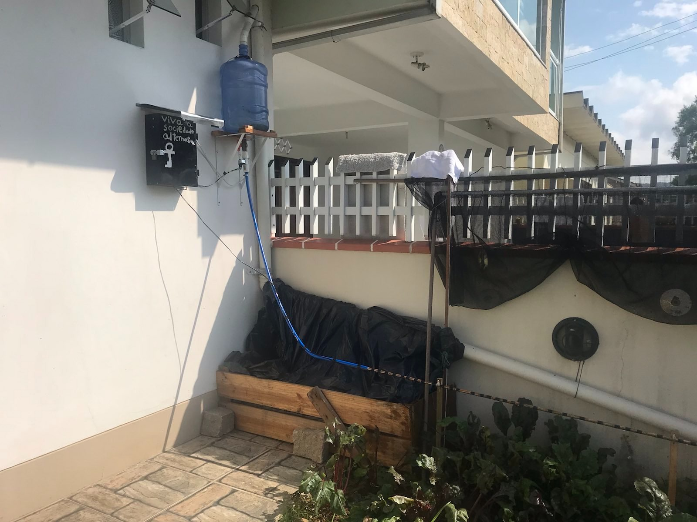

### All components
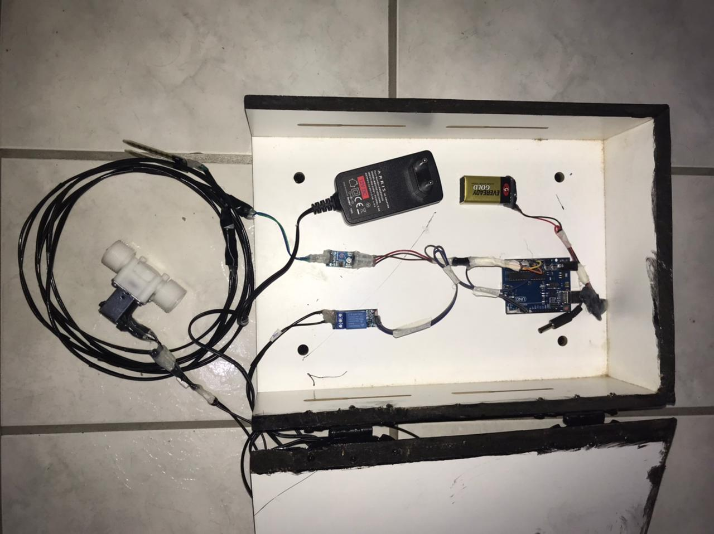

### Final box with components
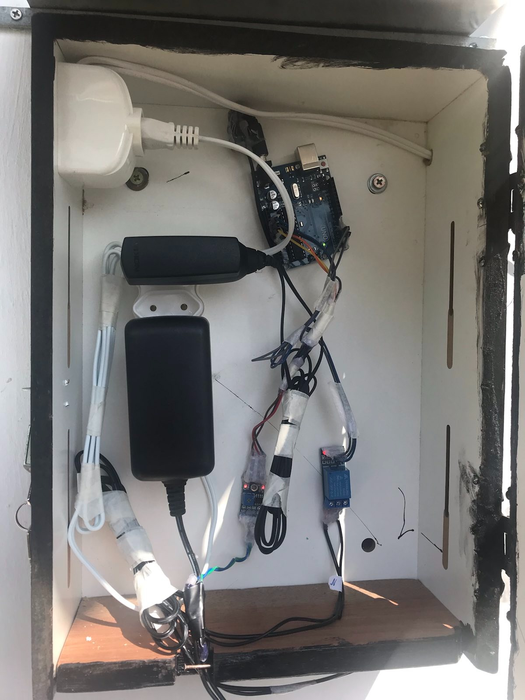

### Button
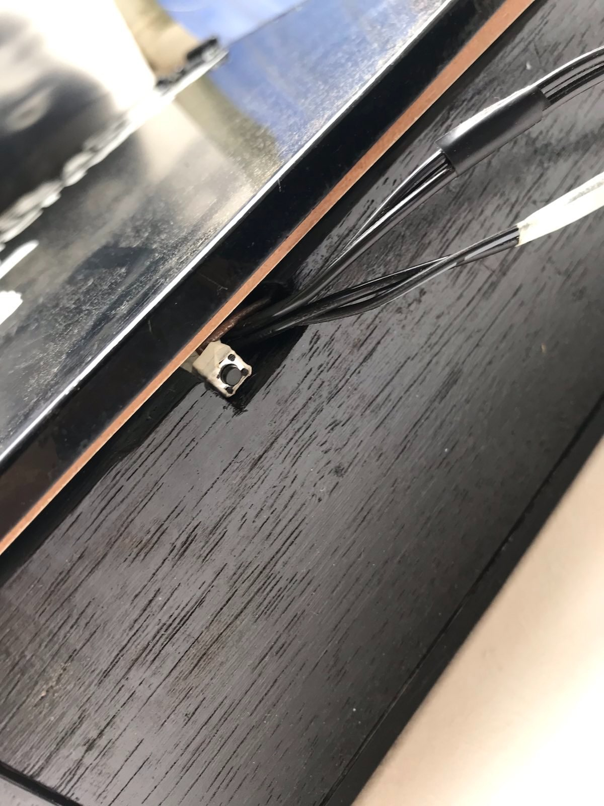

### Humidity sensor in ground
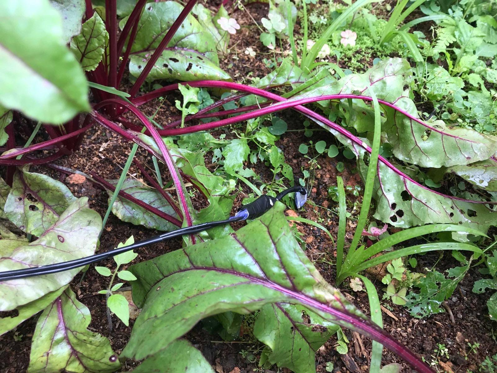

### Water gallon with solenoid valve
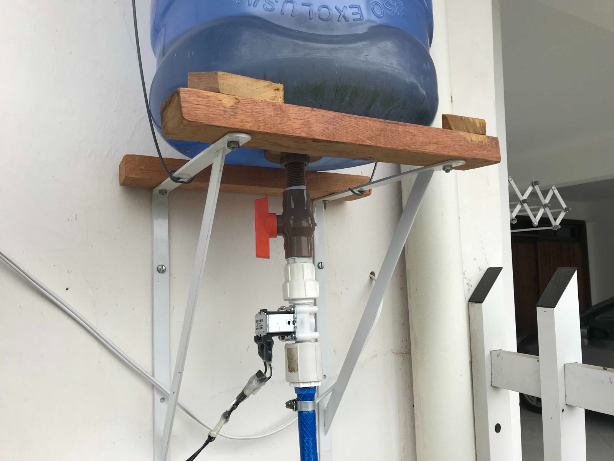

### Pipe
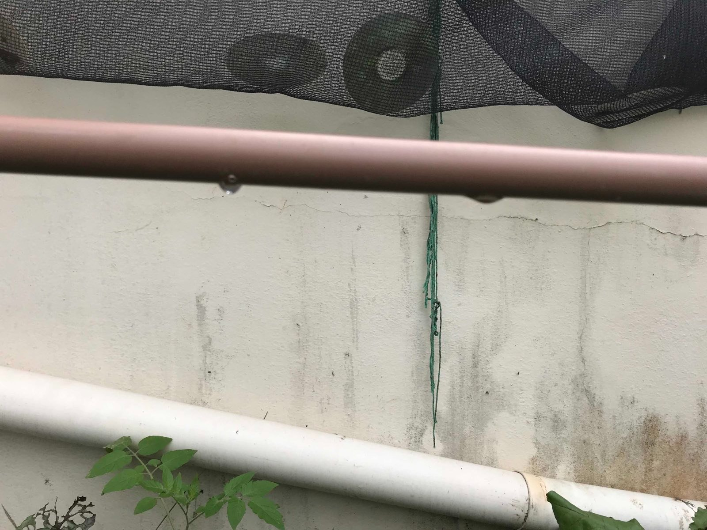

### Pipe to get water rain
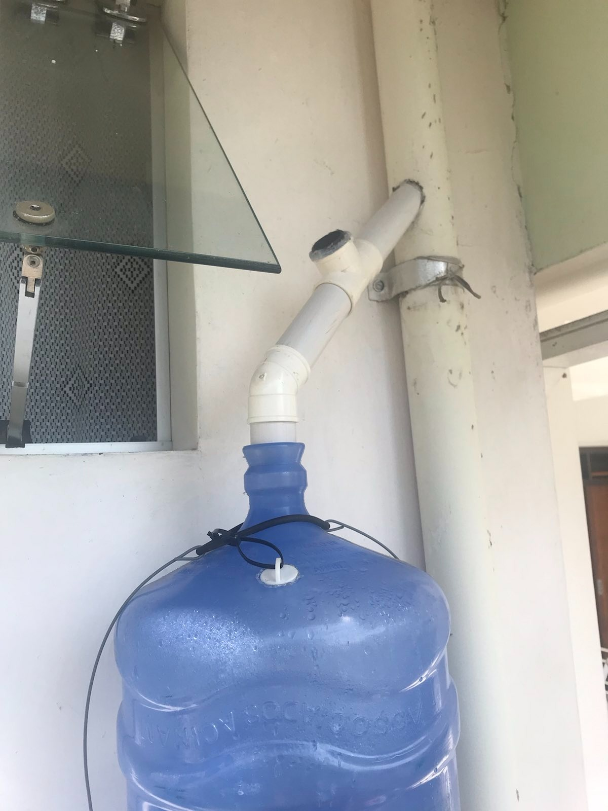

### Battery, Arduino Uno, relay and humidity sensor
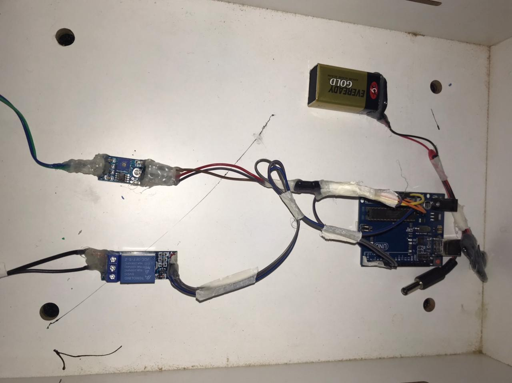

### Humidity sensor
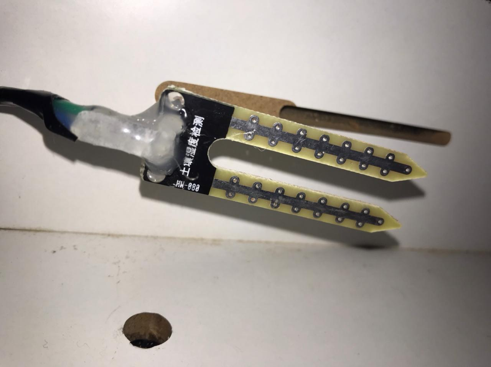

### Solenoid valve
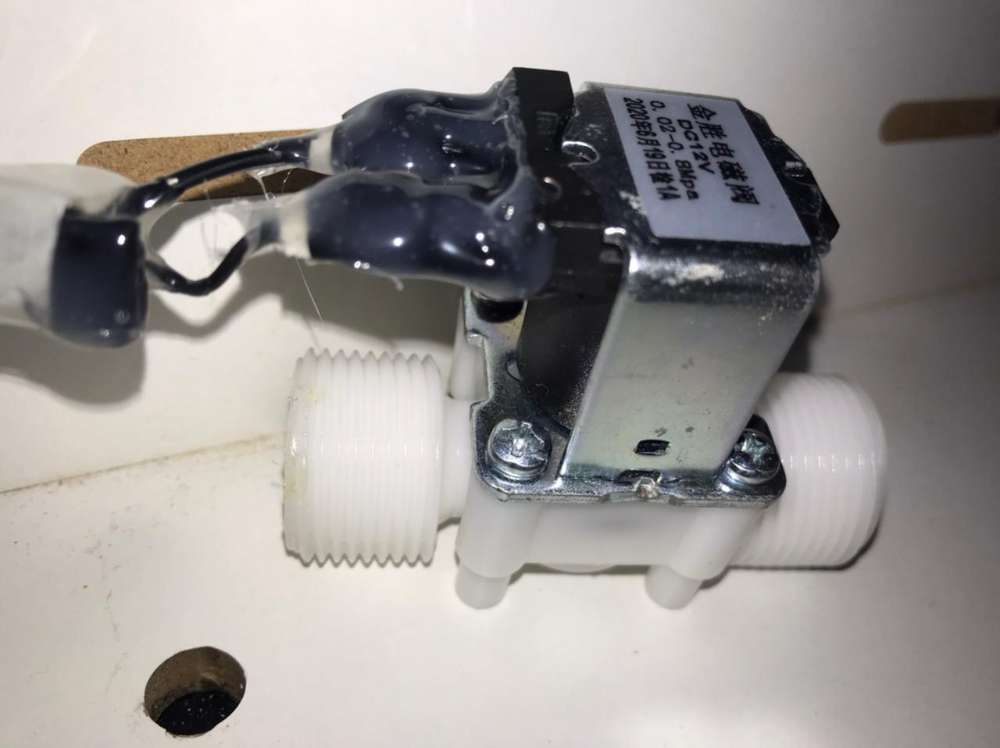

**by: *hotequil*.**
